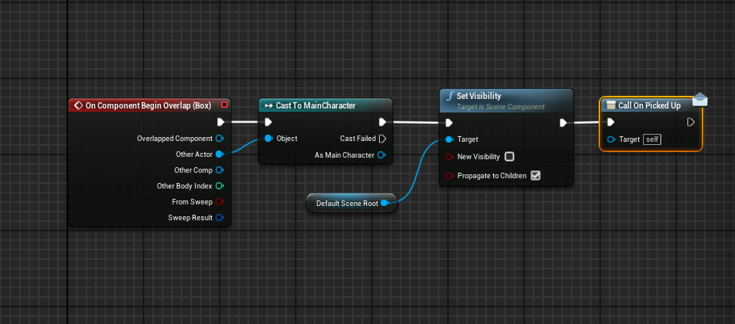

# Ilumination task alu0100969535

# Reached objectives

- [x] Exterior and interior environments
- [x] Use of streaming levels for instantiating the interior level
- [x] Use of a mirror object using a reflective material
- [x] Pickable object that affects the game mechanics
- [ ] Interior environment clearly with deteriorated (old) look
- [x] Player starts near the interior enviroment in the exterior environment
- [x] Exterior environment of medium size, limited by its design
- [x] 3 Different materials for the landscape
- [x] Recognizable paths with intersections. When having the pickable objets some signs will appear
- [x] Game ending will be signaled in some way when reaching a spot

# Technical details

## Environments

### Interior

The interior environment meshes are taken from this Epic resource, [Edith Finch: Edie Room
](https://unrealengine.com/marketplace/en-US/product/ef-edie), which has the models ready to use and a lot of props to play with. 

The room was constructed directly using the provided walls and later on it was added the doors, doorframes, windows and a curtain to cover one window. After that some other props where placed in the room to make a interesting place to see all the ilumination effects.

Also the room has a mirror that was created using a custom material that uses a render target to project what can see the scene capture cube into a texture.

Render target:

Mirror material using that render target:

Mesh with the material applied to simulate a mirror:

#### Ilumination

All the interior ilumination is composed of the global ilumination from the outside and all the baked static ilumination from inside. It has some point light sources in a variety of objetcs with different light intensities and colors to be able to see the blending between them.

### Exterior

The exterior environment was hand made using the landscape tools in UnrealEngine. It is a default sized landscape that has some mountains to limit the visibility of the paths and intersections. There is a range of mountains placed right in the edge of the map to avoid the player getting into the limits.

Fly view of the entire world:

3rd Person view of the world at ground level:

#### Ilumination

All the exterior ilumination is done by a directional light source acting as the sun and a SkySphere to have a more robust global ilumination with a skysphere.

#### Landscape materials

For the landscape a special layered material was created using three base materials: ForestSoil, Moss and Snow.

These three materials were downloaded from [Quixel Megascans](https://quixel.com/megascans/home/)

The individual materials are configured with a material function that has a tiling parameter to be able to configure the mosaic size, and control for tiling at near and far planes. Besides that there is also the usual material parameters as Metallic, Specular, Roughness values to be able to apply the original textures witha  desired weight. 

The material for the landscape then is configured as a blend of the previous material functions

All of the aforementioned parameters can be controlled from the MaterialInstance without the need of compiling shaders

#### Foliage

There is two types of foliage in this game, the bushes and the trees. The bush mesh was obtained from the StarterContent from UnrealEngine and the trees were obtained from this [resource](https://unrealengine.com/marketplace/en-US/product/interactive-spruce-forest) in the UnrealEngine Marketplace.

Bushes:

Trees:

#### Props

Apart from the foliage in the exterior map the only other props are the rock and signs and also the props for the final location.

Signs for navigation:

Same prop without picking the special object:

Props for the end sequence:

## Player

The player model is the Countess from the game Paragon. It was downloaded from the [UnrealEngine Marketplace](https://unrealengine.com/marketplace/en-US/product/paragon-countess)

### Animations

The model came with lots of animations, but we are using only a handful for the folling scenarios:
 - movement (run/stop and lean)
 - attack

Animation Blueprint:

Running animation:

Lean blend into running animation:

Attack animation:

### Actions

The player can move around the environment, all the interaction with the world will be done automatically when the player is near the interactuable object such as the door, the pickable object and the end sequence trigger.

## Other blueprints

Any other blueprint that controls the game flow or any other aspect

### Pickable object

### Level blueprint

All of these features are coded in the level blueprint for the exterior level.

# Screenshots

